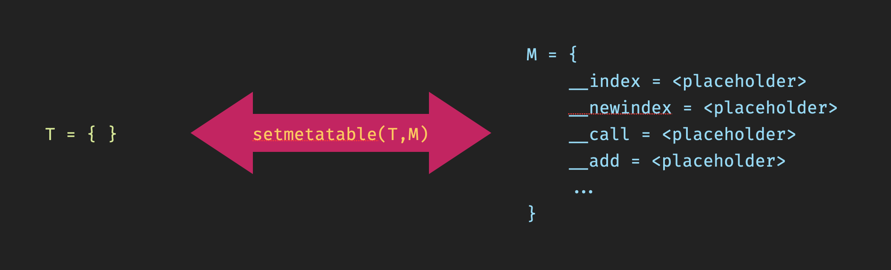

# Lua Metatables

Lua is a minimalistic but powerful scripting language, that only provides few smart mechanisms and doesn't enforce anything,
which gives us a lot of freedom. One of these mechanisms is the *metatable*. I don't even know if other languages have
such thing. Some people think that *metatables* are the Lua *classes*, but that is not really true. Yes, you can mimic OOP
using *metatables*, but as mentioned before Lua doesn't enforce anything and you can use them for whatever you can think of.

It is very helpful if you, the reader, have already understood ...

- tables
- functions
- nil

... otherwise this *metatable* introduction won't make much sense.

## The Basics

A *metatable* (let's call it `M`), is also just a simple table, but with [specific indices](https://www.lua.org/manual/5.4/manual.html#2.4)
and it has to be declared to be the *metatable* of "another" table (let's call that `T`) using the `setmetatable(T,M)` function. These specific
indices or metatable elements act as events. And when one of these events is triggered then Lua can execute something.
You can simply treat these indices as reserved for Lua metatables, and therefore not use them for anything else but
metatables, otherwise you would confuse people reading your code, and probably yourself too.

Let's see which events exist, and what would trigger these events.

- `__index` ➞ when you are accessing a key/index that is not present in the table T.
- `__newindex` ➞ when you are trying to create a new key/index inside the table T
- `__call` ➞ when you are calling a table like a function `T()`.
- Operators ➞ When you use an operator on 1 or 2 tables ...
    - `__add`   ➞ `t1 + t2`
    - `__sub`   ➞ `t1 - t2`
    - `__mul`   ➞ `t1 * t2`
    - `__div`   ➞ `t1 / t2`
    - `__mod`   ➞ `t1 % t2`
    - `__pow`   ➞ `t1 ^ t2`
    - `__unm`   ➞ `-t1`
    - `__idiv`  ➞ `t1 // t2`
    - `__band`  ➞ `t1 & t2`
    - `__bor`   ➞ `t1 | t2`
    - `__bxor`  ➞ `t1 ~ t2`
    - `__bnot`  ➞ `~t1`
    - `__shl`   ➞ `t1 << n`
    - `__shr`   ➞ `t1 >> n`
    - `__concat`➞ `t1 .. t2`
    - `__len`   ➞ `#t1`
    - `__eq`    ➞ `t1 == t2`
    - `__lt`    ➞ `t1 < t2`
    - `__le`    ➞ `t1 <= t2`

Okay, now let's write a small and almost finished code example that shows how to create a *metatable* and how to use `setmetatable()`.

    T = { }

    M =
    {
       __index    = <placeholder>,
       __newindex = <placeholder>,
       __call     = <placeholder>,
       __add      = <placeholder>,
    }

    setmetatable(T, M)

Now we have a metatable `M` that **is connected** to the table `T`. We defined some events in our *metatable*, so that it's clear
**when** to do something. And now only the actions are missing. The `<placeholder>`s are the actions - the "**what** to do"s.
And what do we usually associate with actions? - functions. All of them can be functions, but `__index` and `__newindex`
can also be tables instead of functions, which is actually pretty common.
But for now let's focus on the functions, that only print some text, and let's try to trigger these events.

    T = { }

    M =
    {
       __index    = function() print("this key does not exist in table T")      end,
       __newindex = function() print("you want to create a new key in table T") end,
       __call     = function() print("you are calling T like a function")       end,
       __add      = function() print("you are using the + operator")            end,
    }

    setmetatable(T, M)

    -- trigger the __index event by accessing a non-existing index
    local Foo = T.foo
    
    -- trigger the __newindex event by creating a new index
    T.foo = 123
    
    -- trigger the __call event by calling the table like a function
    T()
    
    -- trigger the __add event by providing tables as operands to the plus operator
    local Sum = T + T

If you execute this it prints ...

    this key does not exist in table T
    you want to create a new key in table T
    you are calling T like a function
    you are using the + operator

Now we have learned the very basics of *metatables*, but this is the most important part, because it explains the event
concept. At the moment the functions don't do much except for the printing, and therefore we will learn in the next
section about the parameters of the *"event-action"* functions we just created.

## The Function Parameters

We were able to trigger the event functions, but what I did not tell you is that Lua also passes some parameters to
these functions. In this section we learn what these functions parameters are.

- `__index = function(t, k) print(t,k) end`
    - `t` is the table of which we tried to access the non-existing key
    - `k` is the non-existing key
- `__newindex = function(t, k, v) print(t,k,v) end`
    - `t` is the table for which we tried to add a new element
    - `k` is the key we tried to create
    - `v` is the value we wanted to assign
- `__call = function(t, ...) print(t,...) end`
    - `t` is the table we called like a function
    - `...` are all parameters passed in parantheses
- `__add = function(t1,t2) print(t1,t2) end`
    - `t1` is the left operand of the plus operator
    - `t2` is the right operand of the plus operator

Let's extend the code using the new information. If you execute it and follow the printed output along with the code, then
you should be able to understand what is what. Some more info on the parameters - the names of the parameters can be
chosen freely. Also for the `__call` event you can replace the `...` with named parameters.

    T = { }
    print("I'm table", T)

    M =
    {
        __index    = function(t,k)
                        print(string.format("the key '%s' does not exist in table '%s'", k, t))
                     end,
        __newindex = function(t,k,v)
                        print(string.format("you want to create a new key '%s' in table '%s' and assign the value '%s'", k, t, v))
                     end,
        __call     = function(t,...)
                        print(string.format("you are calling '%s' like a function with the parameters", t), ...)
                     end,
        __add      = function(t1,t2)
                        print(string.format("you are using the + operator on the tables '%s' and '%s'", t1, t2))
                     end,
    }

    setmetatable(T, M)

    -- trigger the __index event
    local Foo = T.foo

    -- trigger the __newindex event
    T.foo = "bar"

    -- trigger the __call event
    T(1,2,3)

    -- trigger the __add event
    local Sum = T + T

If you execute this it prints for example ...

    I'm table	table: 0x7ffd72d03f50
    the key 'foo' does not exist in table 'table: 0x7ffd72d03f50'
    you want to create a new key 'foo' in table 'table: 0x7ffd72d03f50' and assign the value 'bar'
    you are calling 'table: 0x7ffd72d03f50' like a function with the parameters	1	2	3
    you are using the + operator on the tables 'table: 0x7ffd72d03f50' and 'table: 0x7ffd72d03f50'

## Implementing the behavior

You may have noticed that besides printing text on screen nothing is happening. The values didn't get created, nothing
was assigned, etc. Sure that's simply because we only called `print()` in our functions, but we are responsible for
implementing the desired behavior. The behavior is really up to you. If you only want to print e.g. an error message
saying *'this key does not exist'* for the `__index` event, then that's what you can do. Lua will not tell you how to
use these events.

But let's assume we want to implement the things we would expect from the lines that trigger the events.

    T =
    {
       Value = 55
    }
    
    M =
    {
       __index    = function(t,k)
                    -- return some default value
                       return 123
                    end,
    
       __newindex = function(t,k,v)
                    -- here we need to use the rawset() function, because if we would
                    -- write t[k]=v then we would trigger again __newindex, which would execute this function again and so on.
                    -- rawset() does the same but without triggering __newindex, means it prevents such recursive calls.
                       rawset(t,k,v)
                    end,
    
       __call     = function(t,addme)
                    -- as an example let's just add the parameter to T.Value, but you can code what you want
                       T.Value = T.Value + addme
                    end,
    
       __add      = function(t1,t2)
                    -- I don't think this needs much explanation
                        return t1.Value + t2.Value
                    end,
    }
    
    setmetatable(T, M)
    
    -- trigger the __index event
    local Foo = T.foo
    print(Foo)
    
    -- trigger the __newindex event
    T.Foo = "foo"
    print(T.Foo)
    
    -- trigger the __call event
    T(12)
    print(T.Value)
    
    -- trigger the __add event
    local Sum = T + T
    print(Sum)

and this prints ...

    123
    foo
    67
    134

The take away of this section is simply that we have to take care of the things we expect from these functions, and that
for `__newindex` we have to use `rawset()` if we want to set the value in the table, otherwise we get recursive calls.

## Tables for `__index` and `__newindex`

I mentioned in the beginning that instead of functions, `__index` and `__newindex` can also be used with tables. Means
instead of providing a function, we provide a table. So then, let's create 2 more tables. So as we know the `__index`
(reading) and `__newindex` (writing) events are only triggered if they keys dont't exist in the table `T`. But `__index`
will read the value from the `LookItUpHereTable` table, and `__newindex` will set the value in the `WriteItBackHereTable` table.

    T = { }

    LookItUpHereTable =
    {
       IDontExistInT = "I don't exist in T, but I exist in the look up table"
    }

    WriteItBackHereTable = { }

    M =
    {
        __index    = LookItUpHereTable,
        __newindex = WriteItBackHereTable,
    }

    setmetatable(T, M)

    -- trigger the __index event and get value from the LookItUpHereTable table
    print(T.IDontExistInT)

    -- trigger the __newindex event and set the value in the WriteItBackHereTable table
    T.NewIndex = "I am new"
    print(WriteItBackHereTable.NewIndex)

## Extra Info

In all examples I used separate tables to show which table contains the event information, but Lua has not restrictions
here. We can also put the events and data in the same table.

    T =
    {
        Foo     = 123,
        __index = function(t,k) return 456 end,
    }

    setmetatable(T, T)

    print(T.Foo)
    print(T.Bar)

Also, Lua doesn't forbid using the *metatable* as the `__index` table.

    T = { }
    
    M =
    {
        IDontExistInT = "I exist in M"
    }
    
    M.__index = M
    
    setmetatable(T, M)
    
    print(T.IDontExistInT)

We won't discuss it here, because there are already so many Lua OOP tutorials, but these mechanism are used for realizing
an OOP like behavior in Lua. I hope that what you have learned here will help you to understand the OOP tutorials or
give you ideas what you could do with these *metatables*.
